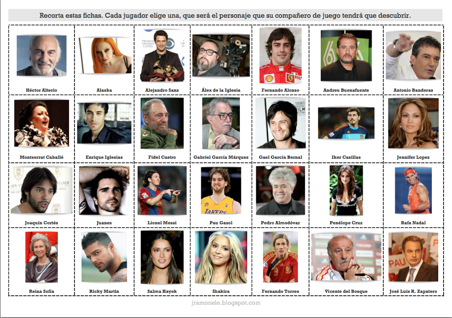
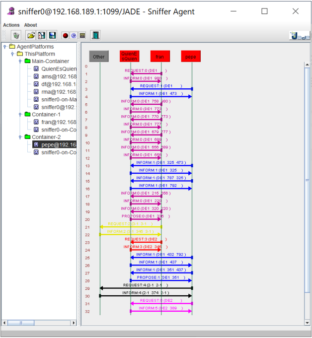

# Nota Final : 10

## Parcipantes:

<table>
  <tr>
    <td align="center"><a href="https://github.com/AnOrdinaryUsser"></td>
    <td align="center"><a href="https://github.com/n0nuser"></td>
  </tr>
</table>

# Enunciado de la práctica de Agentes a realizar con JADE

## Quién es Quién

Todos hemos visto y algunos jugado al juego de Quién es Quién. Ahora se verá cómo se podría hacer que una máquina acierte en quién se está pensando. Para ello, en esta práctica se va a hacer uso de técnicas básicas de Machine Learning que se darán de base para la realización de la
práctica.

Para poder realizar el aprendizaje automático lo primero que se ha realizado es bajar una lista de personas famosas para poder crear un archivo que almacene información de ellos. En la siguiente imagen se pueden ver las personas con las que se puede jugar a quien es quien, esta imagen se ha extraída del siguiente [enlace](http://jramonele.blogspot.com/2011/04/quien-esquien.html).



A partir de estas personas se han elaborado un fichero `.csv` que contiene una serie de variables y los valores para cada uno de los famosos. Como variables se han elegido unas, pero se podría modificar el fichero y añadir nuevas o añadir nuevos famosos. Sólo hay que tener en cuenta que las respuestas deberían de ser `s` o `n` para indicar sí o no de igual manera que se jugaba al quien es quien. Lo normal es que cada famoso saliera más de una vez en el fichero y se guardaran las respuestas que hayan dado más de una persona, pero para el ejemplo nos vale con que cada famoso aparezca una sola vez.

Concretamente las variables que se han incluido son las siguientes:

```
mujer
Actividad que le hizo famoso: cantante profesional
Actividad que le hizo famoso: Deportista Profesional
Actividad que le hizo famoso: Político
Actividad que le hizo famoso Actor: Profesional
Actividad que le hizo famoso: Bailarín Profesional
Actividad que le hizo famoso: Presentador
Actividad que le hizo famoso: Director Cine
nació en España
Sigue vivo
relacionado con el fútbol
deportista profesional en deportes de equipo
Ha jugado en el Real Madrid (mejor equipo de la historia)
Tiene título nobiliario
nació en Colombia
Juega al tenis o está casado con una jugadora de tenis
Manchego
Nació en Méjico
```

Como os podéis imaginar la selección de las variables no es aleatoria, se ha realizado para que permita clasificar de manera correcta a los famosos en todos los casos (salvo equivocación).

Hay una clase Main que usa la clase Pregunta para ir realizando las peticiones a los usuarios y las llamadas a la clase Pregunta para ir adivinando al personaje. La clase Pregunta que se os da de base ya realiza toda la parte de machine learning por lo que esta parte no la tenéis que implementar, básicamente la clase se encarga de leer el fichero de datos famosos.csv, generar el árbol de decisión e interpretar el texto del árbol de decisión que se genera para poder hacer las preguntas (Interpretar en modo texto no es la manera habitual de actuar tal y como se os comenta en el fichero Main.java).

Para realizar la práctica habría que implementar los siguientes agentes:

- *AgentCliente*: El agente del usuario que irá recibiendo las preguntas y mandando las respuestas al *AgentQuienEsQuien* hasta que reciba la predicción. Una vez recibida la predicción volverá al paso inicial para adivinar a otro personaje.

  El agentCliente deberá de ir imprimiendo las preguntas que vaya recibiendo del *AgentQuienEsQuien* para que el usuario pueda escribir una “s” o “n” si la respuesta es sí o no respectivamente.

- **AgentQuienEsQuien**: encargado de ir recibiendo las conexiones de los clientes y las respuestas e ir mandando las preguntas según corresponda. Este agente deber permitir hasta 5 predicciones de manera simultánea sin que haya problemas. Se podría usar `aclMessage.setConversationId(conversationID)`; en los envíos y en las recepciones `blockingReceive(MessageTemplate.MatchConversationId(msgCliente.getConversationId()));` para evitar que se mezclen peticiones de clientes en el *AgentQuienEsQuien*.

  Cada Cliente antes de hacer una petición de adivinar una persona al *AgentQuienEsQuien* debería de generar un ID único de la conversación y mandarlo en cada una de las respuestas hasta que se adivina al personaje. Antes de proceder con adivinar a otra persona debería de generar un nuevo identificador. 

A partir de los requisitos anteriores hay que implementar un sistema multiagente con JADE que permita realizar el cálculo de las rutas.

### Notas

La práctica se debe de realizar con JADE.

Cuando se indica que el *AgentQuienEsQuien* admite hasta 5 peticiones de manera concurrente quiere decir que puede tratar de manera simultánea hasta 5 peticiones de usuarios, aunque no haya contestado todavía ninguno de ellos. Ver usar *ParallelBehaviour*.

No es necesario realizar comprobación de errores ni implementar temporizadores para reiniciar comportamientos en el *AgentQuienEsQuien* por los clientes se caen antes de terminar de adivinar.

Se recomiendo usar `ACLMessage.createReply` para contestar a los mensajes que se van mandando entre el cliente y QuienEsQuien. Rellenad los campos que veáis necesarios para un correcto intercambio de los mensajes.

El agentCliente será el encargado de imprimir la información por pantalla, la información del agente cliente debería de ser algo similar a lo siguiente mostrado para los agentes Fran y Pepe:

```
Usuario Fran

*********Quién Es Quién de JF*****************
PREGUNTA mujer
n
PREGUNTA Actividad que le hizo famoso: cantante profesional
n
PREGUNTA Actividad que le hizo famoso: Deportista Profesional
s
PREGUNTA relacionado con el fútbol
n
PREGUNTA deportista profesional en deportes de equipo
n
PREGUNTA Juega al tenis o está casado con una jugadora de tenis
s
ES Rafael Nadal (1.0)
*********Quién Es Quién de JF*****************
PREGUNTA mujer


Usuario Pepe
*********Quién Es Quién de JF*****************
PREGUNTA mujer
s
PREGUNTA Actividad que le hizo famoso: cantante profesional
s
PREGUNTA Nació en España
n
PREGUNTA Nació en Colombia
s
ES Shakira (1.0)
*********Quién Es Quién de JF*****************
PREGUNTA mujer
```

La secuencia de mensajes que se enviado entre el agentCliente pepe y fran y el *AgentQuienEsQuien* para esta ejecución es la mostrada en el sniffer. No tiene por qué ser igual en vuestro caso. Todos los mensajes enviados desde Fran que aparecen en rosa se corresponden con las preguntas respuestas realizadas para adivinar Rafa Nadal, como tienen el mismo conversationID salen del mismo color. Lo mismo ocurre con los mensajes en azul enviados desde pepe se corresponden con Shakira.


